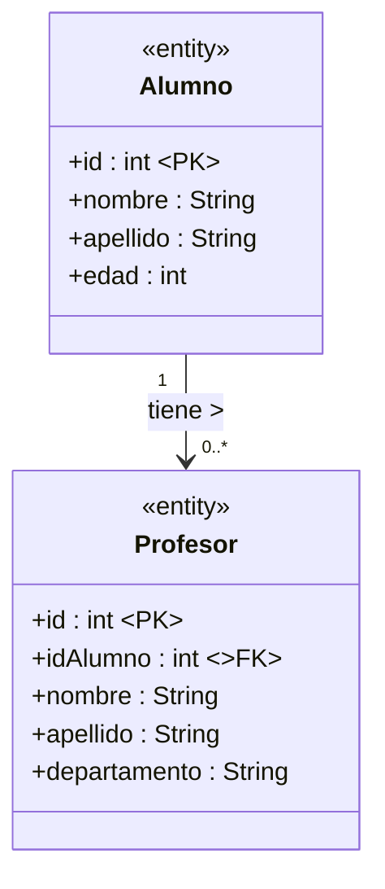
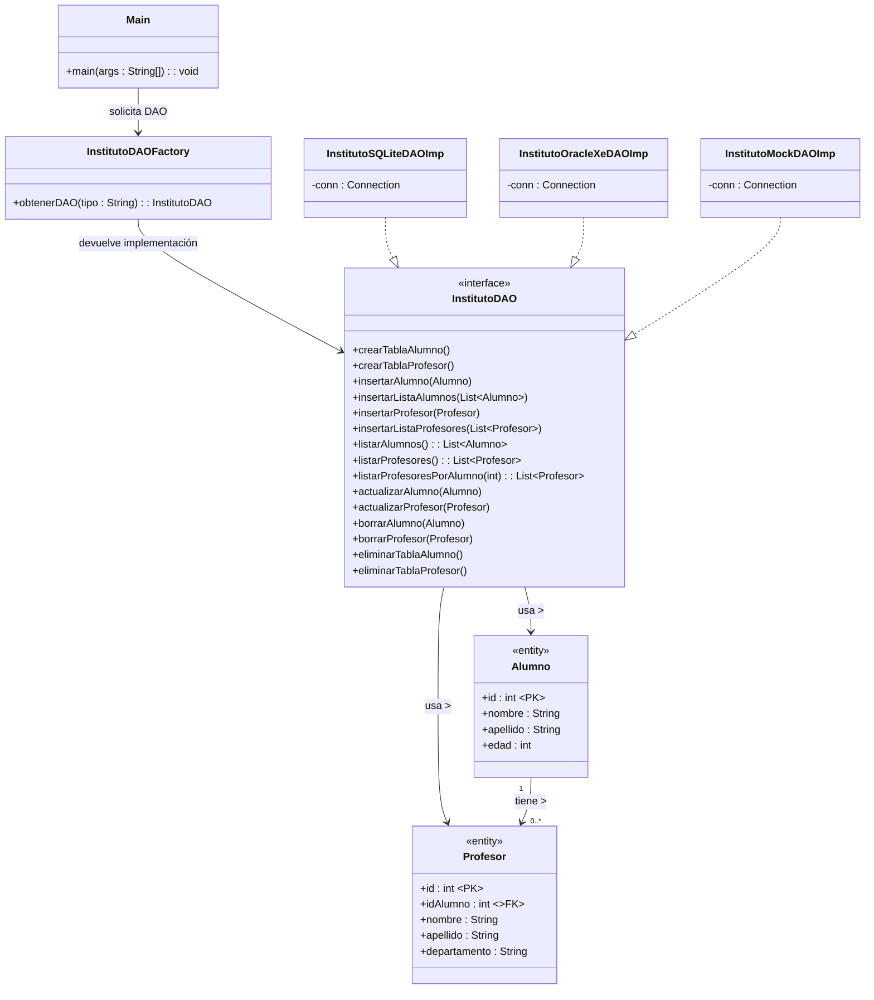

# Gestión de Alumnos – Proyecto Conectores

**Curso:** 2ºDAM  
**Asignatura:** Acceso a Datos  
**Alumno:** *Aaron Gómez Ventero*

---

## Descripción del Proyecto

Este proyecto implementa un sistema de gestión de alumnos de un instituto utilizando el **patrón DAO**, permitiendo conectarse a distintos tipos de bases de datos:

- **Mock** (Sin implementar)  
- **SQLite**  
- **Oracle XE**

El usuario selecciona el tipo de conexión mediante un menú y, a partir de ahí, puede realizar todas las operaciones disponibles sobre las tablas.

Además, se incorpora una **segunda tabla relacionada con alumnos** mediante clave foránea:

- **Tabla alumnos**  
- **Tabla profesores**, con FK → `idAlumno`

---

## Funcionalidades Implementadas

### Gestión de Alumnos

- Crear tabla  
- Insertar alumno  
- Insertar lista de alumnos  
- Listar alumnos  
- Actualizar alumno  
- Borrar alumno  
- Eliminar tabla completa  

### Gestión de Profesores

- Crear tabla  
- Insertar profesor  
- Insertar lista de profesores  
- Listar profesores  
- Listar profesores por alumno (parámetro)  
- Buscar profesor por ID  
- Actualizar profesor  
- Eliminar profesor  
- Eliminar tabla completa  

---

## Menú Principal

### Menú 1 – Selección del tipo de conexión

1️ Mock  
2️ SQLite  
3️ Oracle  

### Menú 2 – Operaciones disponibles

- Crear tablas  
- Insertar Alumno  
- Insertar Profesor  
- Actualizar Alumno  
- Actualizar Profesor  
- Listar todos los alumnos  
- Listar todos los profesores  
- Listar alumnos con sus profesores
- Consulta por parámetro: listar profesores según `alumnoId`  
- Salir  

---

## Tecnologías Utilizadas

- Java 17  
- JDBC  
- SQLite JDBC Driver  
- Oracle XE JDBC Driver  
- Docker (para Oracle XE)  
- Lombok  
- Patrón DAO  

---

## Estructura de Tablas

### Tabla Alumno

| Campo    | Tipo    | PK |
|----------|---------|----|
| id       | INTEGER | ✔️ |
| nombre   | TEXT    |    |
| apellido | TEXT    |    |
| edad     | INTEGER |    |

### Tabla Profesor

| Campo        | Tipo    | PK | FK |
|--------------|---------|----|----|
| id           | INTEGER | ✔️ |    |
| idAlumno     | INTEGER |    | ✔️ |
| nombre       | TEXT    |    |    |
| apellido     | TEXT    |    |    |
| departamento | TEXT    |    |    |

---

## Diagrama UML de las Tablas

---

## Arquitectura del Proyecto

